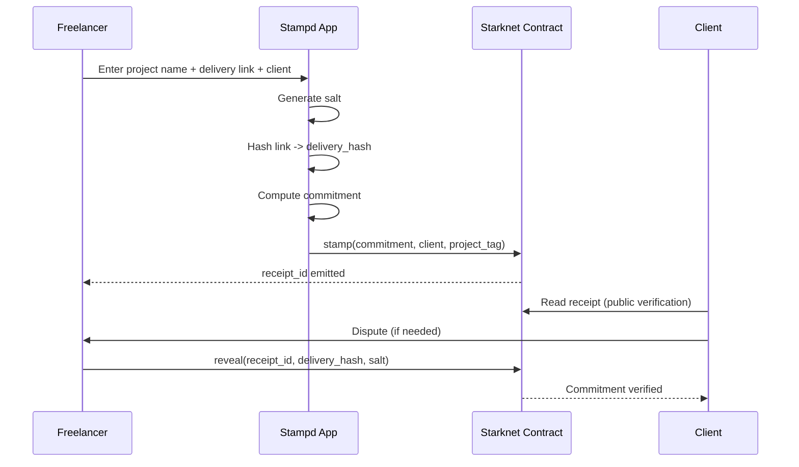

# Stampd

Privacy-preserving proof of delivery and coordination primitive on Starknet.

Stampd allows a freelancer to commit a delivery reference onchain without revealing it publicly. The commitment is timestamped, verifiable, and selectively revealable in case of dispute.

No escrow.
No custody.
No platform lock-in.

Just cryptographic accountability.

---

## Why Stampd

Freelancers often deliver work through links: Google Drive, GitHub, Notion, Figma, email threads.

Disputes are messy.

Screenshots can be edited.
Messages can be deleted.
Platforms can be biased.

Stampd creates a neutral, verifiable commitment on Starknet that proves a delivery existed at a specific time without exposing the private content.

---

## Core Design

Delivery references are never stored onchain.

Instead:

```
delivery_hash = hash(delivery_link)
commitment = hash(delivery_hash, salt, freelancer, client, project_tag)
```

Only the commitment is stored on Starknet.

The original delivery can be revealed later if necessary.

---

## Architecture

Stampd is a lightweight commitment registry with coordination state.

Stored per receipt:

* receipt_id
* commitment
* freelancer
* client
* project_tag (optional hashed label)
* timestamp
* status (Committed | Disputed | Revealed)

---

## Sequence Diagram



---

## Verification Modes

Public verification
Anyone can confirm that a commitment was made by checking the onchain receipt.

Private verification
Freelancer shares delivery link and salt privately.
Client recomputes commitment locally and compares to onchain value.
No public reveal required.

Onchain reveal
If disputed, freelancer calls reveal.
Contract verifies commitment and marks receipt as revealed.

---

## Why Starknet

Stampd leverages Starknet’s STARK secured execution to anchor privacy preserving commitments with low cost and high integrity.

Selective disclosure ensures confidentiality by default while preserving verifiability.

---

## Composability

Other contracts or DAOs can integrate Stampd by checking:

* receipt status
* commitment existence
* reveal state

Stampd acts as a coordination primitive, not a payment layer.

---

## Repository Structure

```
contracts/      Cairo contract (Stampd)
frontend/       React + TypeScript client
docs/           Architecture and specification
```

---

## Status

Active development.
Target: Starknet testnet deployment.