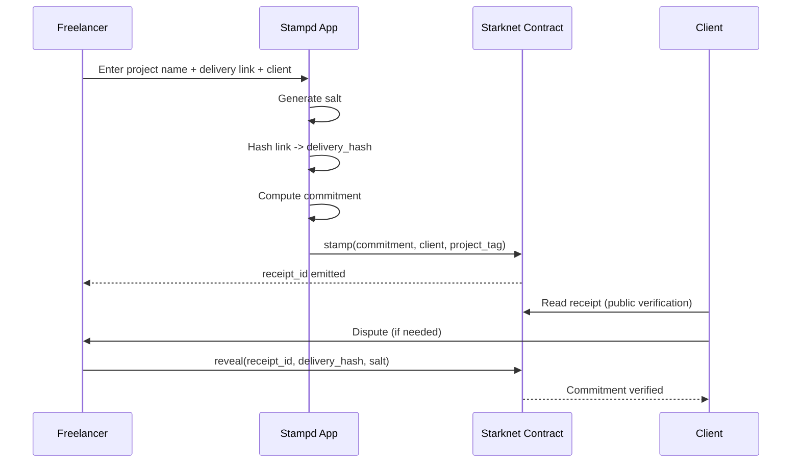

# Stampd

Privacy-preserving proof of delivery and coordination primitive on Starknet.

Stampd allows a freelancer to commit a delivery reference onchain without revealing it publicly. The commitment is timestamped, verifiable, and selectively revealable in case of dispute.

No escrow.
No custody.
No platform lock-in.

Just cryptographic accountability.

---

## Why Stampd

Freelancers often deliver work through links: Google Drive, GitHub, Notion, Figma, email threads.

Disputes are messy.

Screenshots can be edited.
Messages can be deleted.
Platforms can be biased.

Stampd creates a neutral, verifiable commitment on Starknet that proves a delivery existed at a specific time without exposing the private content.

---

## Core Design

Delivery references are never stored onchain.

Instead:

```
delivery_hash = hash(delivery_link)
commitment = hash(delivery_hash, salt, freelancer, client, project_tag)
```

Only the commitment is stored on Starknet.

The original delivery can be revealed later if necessary.

---

## Architecture

Stampd is a lightweight commitment registry with coordination state.

Stored per receipt:

* receipt_id
* commitment
* freelancer
* client
* project_tag (optional hashed label)
* timestamp
* status (Committed | Disputed | Revealed)

---

## Sequence Diagram


```mermaid
sequenceDiagram
    participant F as Freelancer
    participant UI as Stampd App
    participant SN as Starknet Contract
    participant C as Client

    F->>UI: Enter project name + delivery link + client
    UI->>UI: Generate salt
    UI->>UI: Hash link -> delivery_hash
    UI->>UI: Compute commitment
    UI->>SN: stamp(commitment, client, project_tag)
    SN-->>F: receipt_id emitted

    C->>SN: Read receipt (public verification)

    C->>F: Dispute (if needed)
    F->>SN: reveal(receipt_id, delivery_hash, salt)
    SN-->>C: Commitment verified
```

---

## Verification Modes

Public verification
Anyone can confirm that a commitment was made by checking the onchain receipt.

Private verification
Freelancer shares delivery link and salt privately.
Client recomputes commitment locally and compares to onchain value.
No public reveal required.

Onchain reveal
If disputed, freelancer calls reveal.
Contract verifies commitment and marks receipt as revealed.

---

## Why Starknet

Stampd leverages Starknet’s STARK secured execution to anchor privacy preserving commitments with low cost and high integrity.

Selective disclosure ensures confidentiality by default while preserving verifiability.

---

## Composability

Other contracts or DAOs can integrate Stampd by checking:

* receipt status
* commitment existence
* reveal state

Stampd acts as a coordination primitive, not a payment layer.

---

## Repository Structure

```
contracts/      Cairo contract (Stampd)
frontend/       React + TypeScript client
docs/           Architecture and specification
```
---

## How to Run

### 1. Clone the repository

```bash
git clone https://github.com/Fatumayattani/stampd.git
cd stampd
```

---

### 2. Start the frontend

```bash
cd frontend
npm install
npm run dev
```

---

### 3. Connect wallet

* Open the app in your browser
* Connect **Ready Wallet** (or any Starknet-compatible wallet)
* Switch to **Starknet Sepolia**

---

### 4. Interact with the contract

* Enter delivery details
  - stamp committment
  - client address
  - project tag
* Submit a `stamp()` transaction
* View the receipt onchain

---


## Status

✔ Smart contract deployed on Starknet Sepolia  
✔ Frontend integrated with Ready Wallet  
✔ stamp() transaction successfully executed from the UI  
✔ End-to-end flow verified (UI → Wallet → Starknet → Contract)

Contract Address
0x07f50bc88d9568c53a512e96995905e1518acf7167d61471db431845c360db93

Contract Explorer
https://sepolia.voyager.online/contract/0x07f50bc88d9568c53a512e96995905e1518acf7167d61471db431845c360db93

Example Transaction
https://sepolia.voyager.online/tx/0x4e778b42c5ef21166d16314f8a06d526ff0182ecf6b8caf4586608ed8c20e83

## Roadmap

Stampd begins with a focused use case: privacy preserving proof of delivery for freelance work. The long term vision is to evolve Stampd into a universal commitment registry for digital artifacts.

Future directions include expanding Stampd beyond freelancer deliveries to support broader coordination and provenance use cases.

Potential areas include:

- AI dataset and model checkpoint timestamping
- Research artifact commitments before publication
- DAO contributor milestone verification
- Grant and bounty completion proofs
- Software build and release commitments
- Intellectual property and creative work timestamping

By acting as a neutral cryptographic commitment layer, Stampd can serve as infrastructure for applications that require verifiable proof that a digital artifact existed at a specific moment without revealing the underlying content.